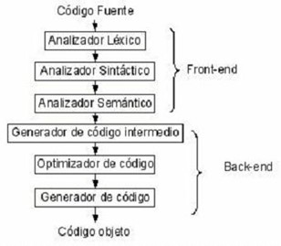
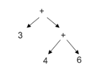
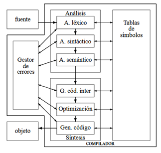

# Compiladores

    
En el inicio de las maquinas, estas ejecutaban instrucciones en códigos numéricos que indicaban a sus circuitos los estados correspondientes a cada operación. A estos códigos los llamamos __Lenguaje Máquina__.
    
Tiempo después, los usuarios de estas máquinas establecieron claves que constituyen   los   llamados   lenguajes   __ensambladores__, mismos que se generalizaron en cuanto se dio el paso decisivo de hacer que las propias máquinas realizaran el proceso mecánico de la traducción. A este trabajo se le llama _ensamblar el programa_.

En 1954 empezó el desarrollo de un lenguaje que permitía escribir fórmulas matemáticas de manera traducible por una máquina. Le llamaron FORTRAN y fue el primer lenguaje considerado de alto nivel.

Fue así como surgió, por primera vez, el concepto de un __traductor__, como un programa que traducía un lenguaje a otro lenguaje. En el caso particular de que el lenguaje a traducir es un lenguaje de alto nivel y el lenguaje traducido de bajo nivel (Lenguaje Máquina), se emplea el término __compilador__.

Ahora bien, ¿en qué consiste un compilador? 

El compilador recibe un código fuente y como se aprecia en la Imagen anterior, consta de múltiples fases: 

1. __Analizador léxico__: lee carácter por carácter y los agrupa en secuencias con significado colectivo y mínimo en el lenguaje, llamadas token. La salida del analizador son tablas relacionadas con lo anterior. Por ejemplo, si la entrada al analizador fuera: <code> numero = 5 </code> la tabla correspondiente sería:
    

    |        | Tipo          | Valor  |
    |--------|---------------|--------|
    | numero | identificador | numero |
    | =      | operador      | =      |
    | 5      | entero        | 5      |

2. __Analizador sintáctico__: intenta generar un árbol sintáctico que encaje con la sentencia de entrada (los tokens proporcionados por el analizador léxico). Un ejemplo de árbol sería: 

 

3.	__Analizador semántico__: se realizan chequeos para asegurar que los componentes del programa encajan significativamente, como por ejemplo chequeo de tipos.

4.	__Generador de código intermedio__: después de la etapa de análisis, se suele generar una representación intermedia explícita del programa fuente. Dicha representación intermedia se puede considerar como un programa para una máquina abstracta. 
    
    Por ejemplo, si queremos representar la instrucción <code>numero = 5</code>. 
    
    Suponiendo que guardaremos los contenidos de las variables desde la dirección de memoria 9000 y las direcciones de memoria a partir de 10000 como direcciones temporales:

    | Operacion | Operando 1 | Operando 2 | Resultado |
    |-----------|------------|------------|-----------|
    | CARGAR    | numero     | NULL       | 9000      |
    | CARGAR    | 5          | NULL       | 10000     |
    | CARGAR    | 10000      | NULL       | 9000      |

5.	__Optimización de código__: Esta fase trata de mejorar el código intermedio, de modo que en la siguiente fase resulte un código de máquina más rápido de ejecutar.

6.	__Generador de código final__: por último, en el proceso de compilación, este generador se encarga de pasar el código intermedio a un lenguaje ensamblador de la máquina que se vaya a utilizar.

Adicional a esto, tenemos dos partes del compilador que se comparten con todas las fases de este. Dichas partes son: 

1.	__Tabla de símbolos__: es una estructura de datos en donde se registran los identificadores de usuario utilizados en el programa fuente y reunir información sobre los distintos atributos de cada identificador. Estos atributos pueden proporcionar información sobre la memoria asignada a un identificador, la dirección de memoria en que se almacenará en tiempo de ejecución, su tipo, su ámbito, etc.

2. __Generador de errores__: informa al compilador donde hay errores y de que tipo son. Este generador debe continuar el proceso aun cuando encuentre errores y solo debe mostrarlos al final del análisis. Cabe mencionar que no puede detectar errores en tiempo de ejecución. 

Entonces tenemos que la estructura del compilador queda de la siguiente forma: 

Como se observa en la imagen, el compilador consta de una parte de análisis y otra de síntesis (o frontend y backend respectivamente como se menciona en la Imagen 1). 
- __Análisis__ (frontend): en la que se analiza el programa fuente para dividirlo en componentes y extraer de algún modo el significado.

- __Síntesis__ (backend): en la que el significado obtenido se escribe en el lenguaje objeto (o lenguaje maquina). 

